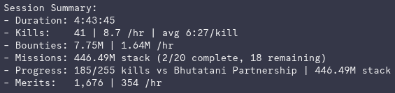
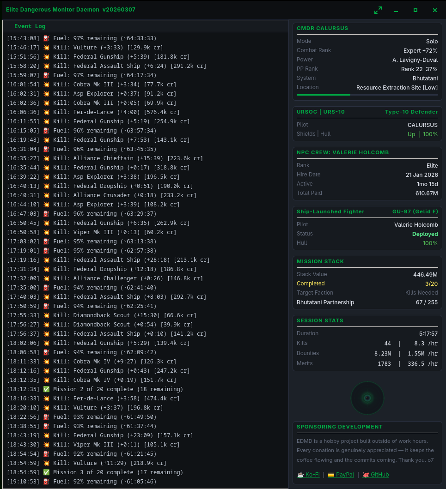
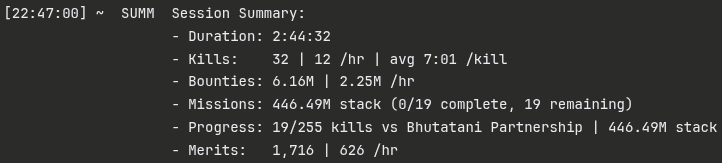
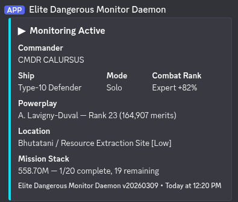

<div align="center">


# Elite Dangerous Monitor Daemon
### EDMD

**Real-time AFK session monitoring for Elite Dangerous**

*Kill tracking · Discord alerts · Session awareness · Mission stack tracking · GTK4 GUI*

---

by **CMDR CALURSUS**

[](https://python.org)
[]()
[]()
[]()
[]()

</div>

---

## Overview

EDMD is a Python daemon that tails your Elite Dangerous journal in real time, watching over your AFK combat sessions so you don't have to. It tracks every kill, bounty, merit, and massacre mission — streaming events to your terminal, a GTK4 GUI window, and optionally to a Discord channel via webhook.

When things go wrong — your fighter blown up, hull taking critical damage, fuel running dry — EDMD will alert you so you can intervene before coming back to a rebuy screen.

---

## Features

<details open>
<summary><strong>💥 Kill &amp; Reward Tracking</strong></summary>

- Logs every `Bounty` and `FactionKillBond` with ship type, time since last kill, and credit value
- Optional pirate pilot name display per kill
- Optional victim faction display per kill
- Running kill count and extended per-faction tallies (configurable)
- Handles both bounty hunting and combat bond (CZ) sessions seamlessly

</details>

<details open>
<summary><strong>📊 Periodic Summaries</strong></summary>

Posted every 15 minutes (while at least one kill has been recorded) — to the terminal/GUI event log and optionally to Discord:

```
Session Summary:
- Duration: 2:14:33
- Kills:    67 | 29.9 /hr | avg 0:53/kill
- Bounties: 5.61M | 2.50M /hr
- Missions: 386.32M stack (18/20 complete, 2 remaining)
- Progress: 67/255 kills vs Bhutatani Partnership | 386.32M stack
- Merits:   1072 | 478 /hr
```

The `Progress` line appears for each target faction when massacre missions are active. The `avg X/kill` interval is included once more than one kill has been recorded.

<div align="center">

<br><em>Session summary posted to Discord</em>
</div>

</details>

<details open>
<summary><strong>🎯 Massacre Mission Stack</strong></summary>

- Tracks all active massacre missions and their combined reward value
- Bootstraps mission state from full journal history on startup — works correctly even when launched mid-session, after a relog, or when missions were accepted in a previous game session
- Filters expired missions automatically using embedded expiry timestamps
- Notifies when kills are completed for individual missions and when the entire stack is ready to turn in
- Announces when the stack reaches its configured maximum size (default 20 missions)
- Displays stack value and completion status in the startup banner and GUI

</details>

<details open>
<summary><strong>🖥️ GTK4 GUI (Linux)</strong></summary>

A full graphical interface alongside the terminal and Discord pipeline:

- **Event log** — scrolling live event feed (left 3/4 of window)
- **Commander panel** — name, ship, game mode, combat rank, powerplay allegiance
- **NPC Crew panel** — crew member name, rank, hire date, active duration, total earnings
- **SLF panel** — fighter type and variant, docked/deployed/destroyed status, orders, hull integrity
- **Mission stack panel** — live stack value, completion progress, status
- **Session stats panel** — kills, credits, merits and their per-hour rates, duration

All panels update live. Supports system theme (Adwaita light/dark auto-detected) and custom colour themes via the `themes/custom/` directory — no CSS expertise required.

Launch with `--gui` or set `Enabled = true` in `[GUI]` of `config.toml`.

<div align="center">

<br><em>GTK4 GUI — default theme, live session in progress</em>
</div>

</details>

<details open>
<summary><strong>⛽ Fuel Monitoring</strong></summary>

- Reports fuel percentage and estimated time remaining on every replenishment tick
- Separate warn/critical thresholds with distinct notification levels
- Critical fuel alerts when percentage drops below a set threshold, or when estimated time remaining falls below a configured number of minutes

</details>

<details open>
<summary><strong>🛡️ Damage &amp; Combat Alerts</strong></summary>

- Shield state changes (raised / dropped)
- Fighter hull damage notifications at each 20% degradation step
- Ship hull integrity reports at each damage event
- Fighter launch, dock, and NPC orders logged live
- Critical alert when your fighter is destroyed
- Critical alert when ship hull falls to or below a configured percentage

</details>

<details open>
<summary><strong>🚨 Security &amp; Cargo Events</strong></summary>

- Cargo scan detection — logs inbound pirate scan attempts with optional pirate name
- Alerts when pirates decline to engage due to insufficient cargo value
- Detects police vessels scanning your ship
- Alerts when security forces begin attacking you

</details>

<details open>
<summary><strong>⚠️ Inactivity Warnings</strong></summary>

- Alerts after a configurable number of minutes with no kills
- Alerts when average kill rate drops below a configurable kills/hour threshold
- Both warnings use a flat cooldown (default 15 minutes, configurable via `WarnCooldown`) to avoid spam

</details>

<details open>
<summary><strong>🔄 Hot-Reload Config</strong></summary>

Most settings take effect within ~1 second of saving `config.toml` — no restart needed. Notification levels, kill rate thresholds, and display options are all hot-reloadable. Journal path and Discord webhook settings require a restart (clearly marked in config).

</details>

<details open>
<summary><strong>📰 Automatic Journal Switching</strong></summary>

Detects when Elite Dangerous creates a new journal file and seamlessly transitions to it. No intervention needed between game sessions.

</details>

---

## Installation

**→ See [INSTALL.md](INSTALL.md) for full installation instructions.**

The short version:

### Linux (Arch)
```bash
sudo pacman -S python-psutil python-gobject gtk4
pip install discord-webhook cryptography --break-system-packages
./install.sh
```

### Linux (Debian / Ubuntu)
```bash
sudo apt install python3-psutil python3-gi gir1.2-gtk-4.0
pip install discord-webhook cryptography --break-system-packages
bash install.sh
```

### Linux (Fedora)
```bash
sudo dnf install python3-psutil python3-gobject gtk4
pip install discord-webhook cryptography --break-system-packages
bash install.sh
```

### Windows
```bat
install.bat
```
or manually: `pip install psutil discord-webhook cryptography`

> **Why not `pip install -r requirements.txt`?**
> `psutil` and `PyGObject` (GTK4, Pango) have C extensions that require system libraries. They must be installed via your distro's package manager. Pango is bundled with GTK4 — no separate install needed. See [INSTALL.md](INSTALL.md) for details.

---

## Quick Start

```bash
# Clone
git clone https://github.com/drworman/EDMD.git
cd EDMD

# Run the installer
bash install.sh          # Linux
install.bat              # Windows

# Configure (set JournalFolder at minimum)
cp example.config.toml config.toml
nano config.toml

# Run
./edmd.py              # terminal mode
./edmd.py --gui        # GTK4 GUI (Linux)
./edmd.py -p MyProfile # with a named config profile
```

---

## Startup Banner

On launch, EDMD preloads the current journal, bootstraps mission state, then prints a session summary:

```
==========================================
  ▶  MONITORING ACTIVE
  CMDR CALURSUS
  Type-10 Defender  |  Solo
  Expert +56%
  A. Lavigny-Duval  Rank 22  (152,198 merits)
  Bhutatani
  Stack: 386.32M (18/20 complete, 2 remaining)
  Kills: 97/255 vs Bhutatani Partnership
==========================================
```

Conditional lines appear only when the relevant data is available:

| Line | Condition |
|------|-----------|
| Powerplay allegiance | Only when pledge is active |
| Location | Only when star system is known |
| Stack | Only when massacre missions are active |
| Kills | Only when target kill quotas are tracked |

<div align="center">

<br><em>Launch banner printed to terminal on startup</em>
</div>

---

## Terminal Output

EDMD prints timestamped event lines to the terminal. Each line carries a fixed-width sigil indicating event category and urgency. When running in GUI mode, terminal output is suppressed and the event log panel receives the same messages with emoji prefixes instead of sigils.

```
[14:23:07] *  KILL  Anaconda [Bhutatani Partnership] +4 [30.25M cr]
[14:31:44] *  MISS  Accepted massacre mission (active: 12)
[14:38:00] ~  SUMM  Session Summary: ...
[14:55:12] !! ATCK  Under attack by security services!
```

**Urgency prefix:**

| Prefix | Meaning |
|--------|---------|
| `!! ` | Critical — immediate threat or loss |
| `!  ` | Warning — degraded state or alert |
| `*  ` | Active event — kill, mission change |
| `^  ` | Damage / defensive event |
| `+  ` | Gain — reward, merit, fuel |
| `~  ` | Summary / periodic report |
| `-  ` | Status / informational |
| `>  ` | Navigation / movement |

**Category tag:**

| Tag | Event type |
|-----|-----------|
| `KILL` | Bounty or faction kill bond awarded |
| `MISS` | Mission accepted, loaded, completed, or abandoned |
| `SUMM` | Session summary (periodic or on demand) |
| `ATCK` | Under attack by security services |
| `WARN` | Inactivity or kill rate alert |
| `SCAN` | Cargo scan, security scan, or outbound scan |
| `SHLD` | Shield state change |
| `HULL` | Ship hull damage |
| `DEAD` | Ship or fighter destroyed |
| `SLF ` | Fighter launched, damaged, or destroyed |
| `FUEL` | Fuel level notification |
| `MERC` | Powerplay merits earned |
| `SHIP` | Ship loadout change |
| `INFO` | Session start, CMDR info, menu/quit events |
| `JUMP` | Supercruise entry or FSD jump |
| `DROP` | Dropped at destination (RES or CZ) |

<div align="center">

<br><em>Periodic session summary — fires every 15 minutes while active</em>
</div>

---

## Discord Integration

EDMD sends structured notifications to a Discord channel via webhook.

**Setup:**
1. In Discord: **Edit Channel → Integrations → Webhooks → New Webhook**
2. Copy the webhook URL
3. Add to `config.toml`:

```toml
[Discord]
WebhookURL = 'https://discord.com/api/webhooks/...'
UserID = 123456789012345678
```

Your `UserID` can be found by enabling Developer Mode in Discord settings, then right-clicking your username. It is used for `@mention` pings on level-3 events.

On startup, EDMD posts a rich embed to Discord with your commander name, ship, game mode, combat rank, and mission stack value.

<div align="center">

<br><em>Startup embed posted to Discord when monitoring begins</em>
</div>

### Notification Levels

Every event type has an independently configurable level:

| Level | Behaviour |
|-------|-----------|
| `0` | Disabled entirely |
| `1` | Terminal/GUI only |
| `2` | Terminal/GUI + Discord |
| `3` | Terminal/GUI + Discord + `@mention` ping |

---

## GUI Theming

<div align="center">

</div>

The GTK4 interface supports full CSS theming. Themes are loaded from the `themes/` directory at startup and can be hot-reloaded by changing `Theme` in `config.toml`.

### How themes work

EDMD uses a two-file system. `themes/base.css` contains all structural rules — layout, spacing, font sizes, and widget geometry. Each theme file contains only a `:root { }` block of CSS custom property (variable) definitions for colours. Both files are loaded together automatically; you never need to touch `base.css`.

This means spacing fixes and layout changes apply to all themes at once, and creating a custom theme is as simple as defining a handful of colour values.

### Built-in themes

| Theme | Accent | Description |
|-------|--------|-------------|
| `default` | 🟠 Orange `#e07b20` | Elite Dangerous orange — the one true choice |
| `default-dark` | 🟠 Orange `#e07b20` | Legacy name, identical to `default` |
| `default-blue` | 🔵 Blue `#3d8fd4` | |
| `default-green` | 🟢 Green `#00aa44` | |
| `default-purple` | 🟣 Purple `#9b59b6` | |
| `default-red` | 🔴 Red `#cc3333` | |
| `default-yellow` | 🟡 Yellow `#d4a017` | |
| `default-light` | System | Accent follows your Adwaita GTK theme |

The avatar mark in the GUI sidebar adapts to the active theme:

<div align="center">


<br><em>default · blue · green · purple · red · yellow · light</em>
</div>

Select a theme in `config.toml`:

```toml
[GUI]
Theme = "default-green"
```

Or per-profile:

```toml
[EDP1]
GUI.Theme = "default-blue"
```

### Custom themes

A ready-to-use template lives at `themes/custom/my-theme.css`. Copy it, rename it, and edit the colour values — that's all that's needed. The `themes/custom/` directory is gitignored so your themes are never overwritten by a pull.

```
themes/
├── base.css              ← structure and layout (do not edit for colours)
├── default.css           ← palette only
├── default-blue.css
│   ...
└── custom/
    ├── .gitkeep
    └── my-theme.css      ← start here (gitignored)
```

```bash
cp themes/custom/my-theme.css themes/custom/mytheme.css
# open themes/custom/mytheme.css and change the colour values
```

Then set it in `config.toml`:

```toml
[GUI]
Theme = "custom/mytheme"
```

The template is thoroughly commented. At minimum, change `--accent` and its two `rgba()` hover variants to match. Everything else — backgrounds, foregrounds, status colours — has sensible defaults you can leave alone or adjust as desired.

The theme name is the path relative to `themes/`, without the `.css` extension.

---

## Configuration Reference

> ✅ = **Hot-reloadable** — takes effect within ~1 second of saving `config.toml`
> ❌ = **Restart required**

### `[Settings]`

| Key | Default | Hot | Description |
|-----|---------|:---:|-------------|
| `JournalFolder` | *(required)* | ❌ | Path to your Elite Dangerous journal directory |
| `UseUTC` | `false` | ✅ | Use UTC timestamps instead of local time |
| `WarnKillRate` | `20` | ✅ | Alert when average kills/hour drops below this value |
| `WarnNoKills` | `20` | ✅ | Alert after this many minutes without a kill |
| `BountyValue` | `false` | ✅ | Show credit value on each kill line |
| `BountyFaction` | `false` | ✅ | Show victim faction on each kill line |
| `PirateNames` | `false` | ✅ | Show pirate pilot names in kill and scan messages |
| `ExtendedStats` | `false` | ✅ | Show running kill counts and per-faction tallies |
| `MinScanLevel` | `1` | ✅ | Minimum scan stage required to log an outbound scan (0 = all) |
| `FullStackSize` | `20` | ✅ | Mission stack size that triggers the "stack full" announcement |
| `WarnCooldown` | `15` | ✅ | Minutes between repeated inactivity / kill-rate alerts |
| `WarnNoKillsInitial` | `5` | ✅ | Minutes before the *first* inactivity alert fires (subsequent alerts use `WarnNoKills`) |
| `TruncateNames` | `30` | ✅ | Maximum character length for pilot/faction names in output |

### `[Discord]`

| Key | Default | Hot | Description |
|-----|---------|:---:|-------------|
| `WebhookURL` | `''` | ❌ | Discord webhook URL |
| `UserID` | `0` | ❌ | Your Discord user ID for `@mention` pings on level-3 events |
| `Identity` | `true` | ❌ | Use EDMD's name and avatar on the webhook |
| `Timestamp` | `false` | ❌ | Append a timestamp to each Discord message |
| `ForumChannel` | `false` | ❌ | Enable forum channel thread support |
| `ThreadCmdrNames` | `false` | ❌ | Use commander name as forum thread title |
| `PrependCmdrName` | `false` | ✅ | Prefix every Discord message with your commander name |

### `[GUI]`

| Key | Default | Hot | Description |
|-----|---------|:---:|-------------|
| `Enabled` | `false` | ❌ | Launch GUI on startup (same as `--gui` flag) |
| `Theme` | `"default"` | ❌ | Theme filename in `themes/` (without `.css`) |

### `[LogLevels]`

All entries are hot-reloadable. Controls terminal, Discord, and GUI event log output.

| Key | Default | Event |
|-----|---------|-------|
| `RewardEvent` | `2` | Each kill — bounty or combat bond |
| `FighterDamage` | `2` | Fighter hull damage (every ~20%) |
| `FighterLost` | `3` | Fighter destroyed |
| `ShieldEvent` | `3` | Ship shield dropped or raised |
| `HullEvent` | `3` | Ship hull damaged |
| `Died` | `3` | Ship destroyed |
| `CargoLost` | `3` | Cargo stolen |
| `LowCargoValue` | `2` | Pirate declined to attack (insufficient cargo) |
| `PoliceScan` | `0` | Security vessel scanned your ship |
| `PoliceAttack` | `3` | Security vessel is attacking you |
| `FuelStatus` | `1` | Routine fuel level report |
| `FuelWarning` | `2` | Fuel level below warning threshold |
| `FuelCritical` | `3` | Fuel level below critical threshold |
| `MissionUpdate` | `2` | Mission accepted, completed, redirected, or removed |
| `AllMissionsReady` | `3` | All active massacre missions ready to turn in |
| `MeritEvent` | `0` | Individual merit gain from a kill |

| `InactiveAlert` | `3` | No kills for the configured time period |
| `RateAlert` | `3` | Kill rate below the configured threshold |
| `InboundScan` | `0` | Incoming cargo scan from a pirate |

---

## Command Line Arguments

```
python edmd.py [-p PROFILE] [-g] [-r]
```

| Flag | Description |
|------|-------------|
| `-p`, `--config_profile` | Load a named config profile |
| `-g`, `--gui` | Launch GTK4 graphical interface (Linux only) |
| `-r`, `--resetsession` | Reset session stats after journal preload completes |

---

## Config Profiles

Profiles let you override any setting for a specific commander or purpose. Define them as named sections in `config.toml`:

```toml
[MyProfile]
Settings.JournalFolder = "/path/to/alternate/journals"
Discord.WebhookURL = 'https://discord.com/api/webhooks/...'
Discord.UserID = 123456789012345678
GUI.Theme = "default-green"
```

Load explicitly with `-p MyProfile`, or name the profile after your commander name for automatic selection at startup.

Multiple profiles coexist in the same config file — useful for multi-account setups:

```toml
[EDP1]
Settings.JournalFolder = "/home/user/games/ED-Logs/EDP1"
Discord.WebhookURL = 'https://discord.com/api/webhooks/...'

[EDP2]
Settings.JournalFolder = "/home/user/games/ED-Logs/EDP2"
Discord.WebhookURL = 'https://discord.com/api/webhooks/...'
```

---

## How Mission Bootstrap Works

When EDMD starts, it needs to know which massacre missions you have active and what they're worth. The game's `Missions` journal event at login contains the active mission list but frequently omits reward values — and if EDMD is launched mid-session, that event may not appear in the current journal at all.

EDMD resolves this by scanning **all available journal files** in chronological order after preload completes, replaying `MissionAccepted`, `MissionCompleted`, `MissionAbandoned`, `MissionFailed`, and `MissionRedirected` events to reconstruct exactly which missions are active, what they're worth, and how many have had their kill quota met. Missions whose `Expiry` timestamp has passed are filtered out automatically.

This means your stack value and completion count are accurate from the moment monitoring goes live, regardless of when or how EDMD was started.

---

## Notes

- **Fuel alerts** trigger on *either* the percentage threshold *or* the estimated time-remaining threshold — whichever fires first.
- **Duplicate suppression** caps repeated identical Discord messages at 5 before switching to a suppression notice, preventing notification floods.
- **SLF shields** are not yet tracked in GUI mode — the game does not report fighter shield state in the journal or Status.json. This will be added in a future update.
- **Journal path (Windows):** `%USERPROFILE%\Saved Games\Frontier Developments\Elite Dangerous`
- **Journal path (Linux/Proton):** varies — use `find ~/ -name "Journal*.log"` to locate it.
- **Network paths:** UNC paths are supported on Windows, e.g. `\\SERVER\Share\Saved Games\...`

---

<div align="center">

*Fly safe out there, CMDR.*


**Elite Dangerous Monitor Daemon** · by CMDR CALURSUS

</div>
