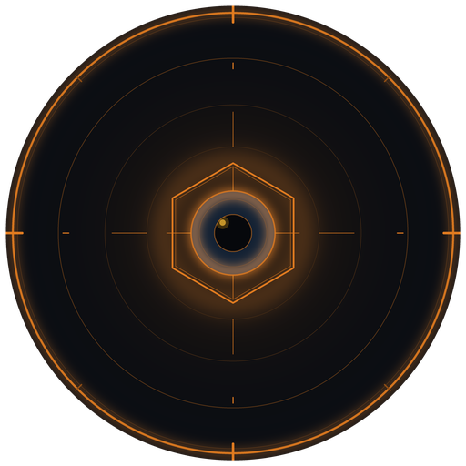
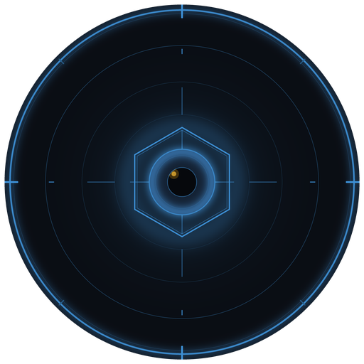
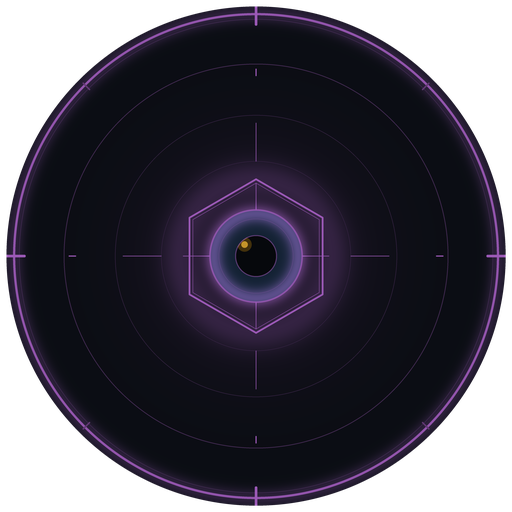
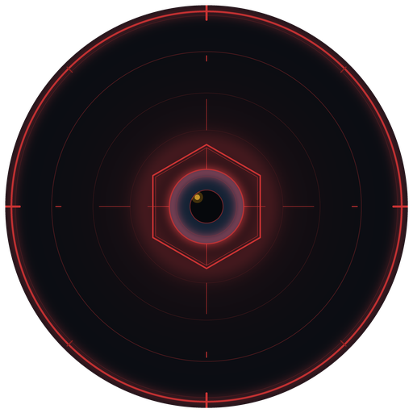
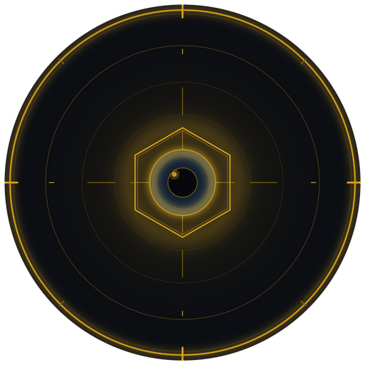
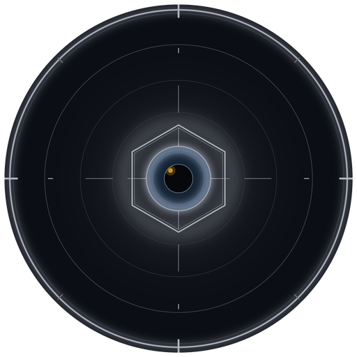

# EDMD GUI Theming

The GTK4 interface supports full CSS theming. Themes are loaded from the `themes/` directory at startup.

---

## How Themes Work

EDMD uses a two-file system. `themes/base.css` contains all structural rules — layout, spacing, font sizes, and widget geometry. Each theme file contains only a `:root { }` block of CSS custom property (variable) definitions for colours. Both files are loaded together automatically; you never need to touch `base.css`.

This means spacing fixes and layout changes apply to all themes at once, and creating a custom theme is as simple as defining a handful of colour values.

---

## Built-in Themes

| Theme | Accent | Description |
|-------|--------|-------------|
| `default` | 🟠 Orange `#e07b20` | Elite Dangerous orange — the one true choice |
| `default-dark` | 🟠 Orange `#e07b20` | Legacy name, identical to `default` |
| `default-blue` | 🔵 Blue `#3d8fd4` | |
| `default-green` | 🟢 Green `#00aa44` | |
| `default-purple` | 🟣 Purple `#9b59b6` | |
| `default-red` | 🔴 Red `#cc3333` | |
| `default-yellow` | 🟡 Yellow `#d4a017` | |
| `default-light` | System | Accent follows your Adwaita GTK theme |

The avatar mark in the GUI sidebar adapts to the active theme:

<div align="center">







<br><em>default · blue · green · purple · red · yellow · light</em>
</div>

---

## Selecting a Theme

In `config.toml`:

```toml
[GUI]
Theme = "default-green"
```

Or per-profile:

```toml
[EDP1]
GUI.Theme = "default-blue"
```

The theme name is the path relative to `themes/`, without the `.css` extension.

---

## Custom Themes

A ready-to-use template lives at `themes/custom-template.css`. Copy it into `themes/custom/`, rename it, and edit the colour values — that's all that's needed. The `themes/custom/` directory is gitignored so your themes are never overwritten by a pull.

```
themes/
├── base.css                ← structure and layout (do not edit for colours)
├── default.css             ← palette only
├── default-blue.css
│   ...
├── custom-template.css     ← copy this to get started (tracked, never clobbered)
└── custom/
    └── mytheme.css         ← your themes live here (gitignored)
```

```bash
cp themes/custom-template.css themes/custom/mytheme.css
# open themes/custom/mytheme.css and change the colour values
```

Then set it in `config.toml`:

```toml
[GUI]
Theme = "custom/mytheme"
```

The template is thoroughly commented. At minimum, change `--accent` and its two `rgba()` hover variants to match. Everything else — backgrounds, foregrounds, status colours — has sensible defaults you can leave alone or adjust as desired.
